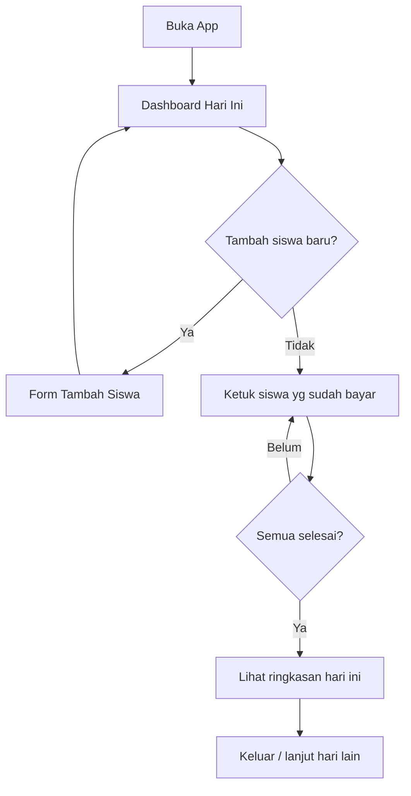

# App Flow - Bendehara Alien

## Main User Flow

## Entry Points
- Buka aplikasi → langsung ke **Dashboard Hari Ini** (tanggal sekarang, daftar siswa, status bayar).
- Dari Dashboard bisa pindah tanggal (hari sebelumnya / pilih tanggal dari kalender).
- Tab: **Beranda** | **Kas** | **Catatan** | **Anak** | **Atur**. Beranda = ringkasan hari ini/bulan ini + pintu masuk ke tab lain.

## Screens / States

| Screen / State | Purpose | User Action | Next State |
| --- | --- | --- | --- |
| Dashboard Hari Ini | Lihat & tandai status bayar hari ini | Ketuk siswa → toggle sudah/belum bayar | Ringkasan otomatis di layar sama |
| Pilih Tanggal | Buka periode lain (masa lalu) | Pilih tanggal di kalender | Dashboard tanggal tsb |
| Daftar Siswa | Kelola siswa | Ketuk siswa → profil; tombol + → form tambah | Profil Siswa / Form Tambah |
| Profil Siswa | Detail + riwayat + tunggakan | Edit data / lihat riwayat | Form Edit / Riwayat Siswa |
| Riwayat | Daftar hari per bulan + rekap | Ketuk hari → detail hari | Detail Hari |
| Detail Hari | Siapa sudah/belum bayar di tanggal itu | Edit status | Kembali ke Riwayat |
| Pengaturan | Nominal default, nama kelas, backup | Ubah & simpan | Simpan → kembali |

## Happy Path
1. Buka app → Dashboard menampilkan tanggal hari ini, semua siswa status "Belum".
2. Bendahara mengetuk siswa yang sudah membayar → berubah hijau "Lunas".
3. Setelah selesai, ringkasan atas menampilkan "20/25 siswa, Rp40.000".
4. Tutup app. Besok buka lagi → tanggal baru otomatis, status reset "Belum".

## Edge Cases
- **Tanggal dobel:** periode untuk tanggal yang sama sudah ada → tampilkan periode tsb (tidak buat baru).
- **Lupa catat kemarin:** pilih tanggal kemarin → catat/ubah status, aman.
- **Siswa baru di tengah bulan:** siswa baru muncul di semua periode? Tidak - hanya periode yang dibuka setelahnya; periode lama tetap sesuai catatan.
- **Nominal berubah:** ubah nominal per hari tanpa mengubah hari lain.
- **Salah ketuk:** ketuk lagi untuk membalik status (toggle), atau edit di Detail Hari.
- **Tanggal masa depan:** diblokir (peringatan "tanggal belum tiba"), kecuali pengaturan diubah.

## Error States
- Belum ada siswa: tampilkan empty state "Tambahkan siswa dulu" + tombol +.
- Tanggal invalid (31 Feb): kalender mencegah pemilihan.
- Simpan gagal (disk penuh, jarang): toast error + data tetap di memori.

## Empty / Loading States
- Empty: belum ada siswa / belum ada catatan di bulan itu → pesan ramah + CTA.
- Loading: sangat cepat (lokal); tidak perlu spinner berat, cukup indikator halus.
- Success: toast hijau "Tersimpan" (opsional, tidak mengganggu).
- Failure: toast merah + saran ulangi.

## Related Notes
- [[Docs/PRD - Bendehara Alien]]
- [[Docs/UI UX Design Concept - Bendehara Alien]]
- [[Docs/Backend Schema - Bendehara Alien]]
