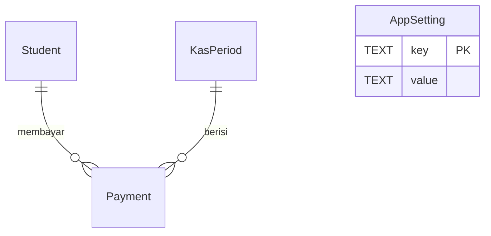

# Backend Schema - Bendehara Alien

## Overview
Database **SQLite lokal** di perangkat (tanpa server). Skema dirancang agar sederhana, mudah dimigrasi, dan query rekap cepat. Semua nominal rupiah disimpan sebagai **INTEGER** (rupiah utuh, bukan float) agar uang tidak pernah salah karena pembulatan.

## Entities

| Entity | Purpose | Notes |
| --- | --- | --- |
| Student | Data siswa (profil) | Soft-delete (is_active) agar riwayat aman |
| KasPeriod | Periode kas = 1 hari | Satu baris per tanggal (unik) |
| Payment | Status bayar siswa pada periode | Satu baris per (periode, siswa) |
| AppSetting | Pengaturan key-value | Nominal default, nama kelas, dll |

## Tables / Collections

### Table - Student
| Field | Type | Required | Notes |
| --- | --- | --- | --- |
| id | INTEGER PK AUTOINCREMENT | yes | |
| name | TEXT | yes | Nama siswa |
| nis | TEXT | no | Nomor induk / no. urut |
| photo_uri | TEXT | no | Path foto lokal (opsional) |
| is_active | INTEGER (0/1) | yes | 1 = aktif; 0 = diarsipkan |
| created_at | TEXT (ISO) | yes | |
| updated_at | TEXT (ISO) | yes | |

### Table - KasPeriod
| Field | Type | Required | Notes |
| --- | --- | --- | --- |
| id | INTEGER PK AUTOINCREMENT | yes | |
| date | TEXT 'YYYY-MM-DD' | yes | UNIQUE - satu periode per tanggal |
| amount | INTEGER | yes | Nominal per siswa hari itu (rupiah) |
| note | TEXT | no | Catatan opsional |
| created_at | TEXT (ISO) | yes | |

### Table - Payment
| Field | Type | Required | Notes |
| --- | --- | --- | --- |
| id | INTEGER PK AUTOINCREMENT | yes | |
| period_id | INTEGER FK -> KasPeriod.id | yes | |
| student_id | INTEGER FK -> Student.id | yes | |
| paid | INTEGER (0/1) | yes | 1 = sudah bayar |
| paid_at | TEXT (ISO) | no | Waktu tandai bayar (audit) |
| updated_at | TEXT (ISO) | yes | |
| UNIQUE (period_id, student_id) | | | tidak ada duplikat |

### Table - AppSetting
| Field | Type | Required | Notes |
| --- | --- | --- | --- |
| key | TEXT PK | yes | contoh: default_amount, class_name, school_year |
| value | TEXT | yes | disimpan sebagai string, dikonversi di app |

## Relationships

## API Resource Mapping
Tidak ada API (aplikasi lokal). "Resource" = query repository:
- `getPeriodByDate(date)` -> KasPeriod + seluruh Payment (join Student).
- `getMonthSummary(year, month)` -> total siswa, total bayar, total Rp per hari.
- `getStudentHistory(studentId)` -> seluruh Payment siswa (join KasPeriod untuk tanggal).
- `getArrears(studentId)` -> periode dengan paid=0 (untuk tunggakan).

## Validation Rules
- `KasPeriod.date` UNIQUE -> tidak ada periode dobel (presisi tanggal).
- `amount >= 0` dan INTEGER.
- `Payment.UNIQUE(period_id, student_id)` -> satu status per siswa per hari.
- Siswa baru tidak otomatis masuk ke periode yang sudah dibuat (riwayat tidak berubah).
- Hapus siswa = soft-delete (is_active=0); Payment tetap ada.

## Indexing / Query Notes
- Index pada `Payment(period_id)`, `Payment(student_id)`, `KasPeriod(date)`.
- Ukuran data kecil (< 50 siswa x ~365 hari/tahun) -> performa trivially cepat tanpa optimasi lanjutan.
- Rekap bulanan dihitung on-the-fly dari Payment (tanpa tabel agregat = lebih mudah maintenance).

## Migration Notes
- Schema v1 (MVP): 4 tabel di atas.
- Migrasi dengan sqflite version + onUpgrade (bertahap).
- Fase 2: tabel `Backup` (file JSON export) bila perlu.
- Fase 3 (jika sync dibutuhkan): tambah kolom `updated_at` sudah ada -> siap untuk last-write-wins.

## Related Notes
- [[Docs/TRD - Bendehara Alien]]
- [[Docs/PRD - Bendehara Alien]]
- [[Docs/ADR - 001 Local-first Storage]]
