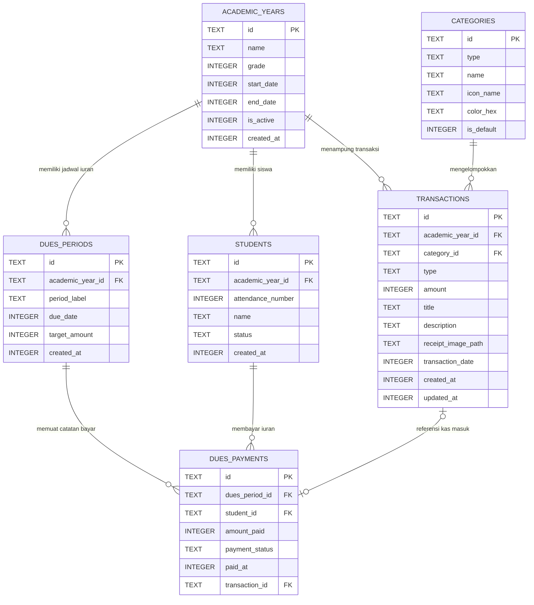

# Database Schema Specification & Data Durability Plan
# Bendahara v2: Rancangan Skema Relasional & Ketahanan 6 Tahun

## 1. Prinsip Desain Basis Data
1. **Penyimpanan Nominal Integer (Bebas Galat Pembulatan)**: Semua nominal uang (`amount`) disimpan dalam tipe data `INTEGER` (satuan Rupiah murni, contoh: `5000` untuk Rp 5.000). Tidak menggunakan float atau double demi menghindari galat pembulatan floating point matematis.
2. **Kunci Primer UUID v4 / Nanoid**: Mencegah konflik identitas data saat proses pencadangan, pemulihan, atau penggabungan data.
3. **Pemberian Indeks (Indexing) Komprehensif**: Kueri agregasi bulanan, tahunan, dan lintas rentang dipastikan tetap instan (< 10 milidetik) bahkan setelah menampung puluhan ribu baris data selama 6 tahun sekolah.
4. **Keamanan Relasi Keras (Referential Integrity)**: Mengaktifkan `PRAGMA foreign_keys = ON;` agar tidak terjadi data tanpa induk (*orphan data*).

---

## 2. Diagram Hubungan Entitas (Entity-Relationship)



---

## 3. Definisi Skema SQLite (DDL)

```sql
-- Mengaktifkan integritas kunci asing & jurnal WAL
PRAGMA foreign_keys = ON;
PRAGMA journal_mode = WAL;

-- 1. TABEL TAHUN AJARAN / PERIODE KELAS
CREATE TABLE IF NOT EXISTS academic_years (
    id TEXT PRIMARY KEY NOT NULL,
    name TEXT NOT NULL,                     -- Contoh: "Kelas 7A (2026/2027)"
    grade INTEGER NOT NULL,                 -- 7, 8, 9 (SMP) atau 10, 11, 12 (SMA)
    start_date INTEGER NOT NULL,            -- Unix timestamp milidetik
    end_date INTEGER NOT NULL,              -- Unix timestamp milidetik
    is_active INTEGER NOT NULL DEFAULT 1,   -- 1 = aktif, 0 = arsip
    created_at INTEGER NOT NULL
);

-- 2. TABEL DAFTAR SISWA KELAS
CREATE TABLE IF NOT EXISTS students (
    id TEXT PRIMARY KEY NOT NULL,
    academic_year_id TEXT NOT NULL,
    attendance_number INTEGER NOT NULL,     -- Nomor absen (1, 2, 3...)
    name TEXT NOT NULL,
    status TEXT NOT NULL DEFAULT 'active',  -- 'active', 'transferred', 'graduated'
    created_at INTEGER NOT NULL,
    FOREIGN KEY (academic_year_id) REFERENCES academic_years(id) ON DELETE CASCADE
);

CREATE INDEX IF NOT EXISTS idx_students_year ON students(academic_year_id);
CREATE INDEX IF NOT EXISTS idx_students_attendance ON students(academic_year_id, attendance_number);

-- 3. TABEL KATEGORI TRANSAKSI
CREATE TABLE IF NOT EXISTS categories (
    id TEXT PRIMARY KEY NOT NULL,
    type TEXT NOT NULL,                     -- 'income' (pemasukan) atau 'expense' (pengeluaran)
    name TEXT NOT NULL,                     -- Contoh: 'Uang Kas Mingguan', 'Alat Tulis', dsb
    icon_name TEXT NOT NULL,                -- Identifier icon lokal
    color_hex TEXT NOT NULL,                -- Kode warna aksen (HEX)
    is_default INTEGER NOT NULL DEFAULT 0,  -- 1 untuk kategori bawaan sistem
    created_at INTEGER NOT NULL
);

-- 4. TABEL TRANSAKSI KAS UTAMA
CREATE TABLE IF NOT EXISTS transactions (
    id TEXT PRIMARY KEY NOT NULL,
    academic_year_id TEXT NOT NULL,
    category_id TEXT NOT NULL,
    type TEXT NOT NULL,                     -- 'income' atau 'expense'
    amount INTEGER NOT NULL,                -- Nominal dalam Rupiah murni (positif)
    title TEXT NOT NULL,                    -- Judul ringkas transaksi
    description TEXT,                       -- Keterangan tambahan (opsional)
    receipt_image_path TEXT,                -- Nama berkas nota lokal (opsional)
    transaction_date INTEGER NOT NULL,      -- Unix timestamp waktu transaksi
    created_at INTEGER NOT NULL,
    updated_at INTEGER NOT NULL,
    FOREIGN KEY (academic_year_id) REFERENCES academic_years(id) ON DELETE RESTRICT,
    FOREIGN KEY (category_id) REFERENCES categories(id) ON DELETE RESTRICT
);

CREATE INDEX IF NOT EXISTS idx_transactions_year_date ON transactions(academic_year_id, transaction_date DESC);
CREATE INDEX IF NOT EXISTS idx_transactions_category ON transactions(category_id);
CREATE INDEX IF NOT EXISTS idx_transactions_type ON transactions(type);

-- 5. TABEL PERIODE IURAN RUTIN (Misal: Kas Minggu Ke-1 s/d Ke-4)
CREATE TABLE IF NOT EXISTS dues_periods (
    id TEXT PRIMARY KEY NOT NULL,
    academic_year_id TEXT NOT NULL,
    period_label TEXT NOT NULL,             -- Contoh: "Minggu 1 September 2026"
    due_date INTEGER NOT NULL,
    target_amount INTEGER NOT NULL,         -- Standar nominal per siswa (misal: 5000)
    created_at INTEGER NOT NULL,
    FOREIGN KEY (academic_year_id) REFERENCES academic_years(id) ON DELETE CASCADE
);

CREATE INDEX IF NOT EXISTS idx_dues_periods_year ON dues_periods(academic_year_id, due_date ASC);

-- 6. TABEL DETAIL PEMBAYARAN IURAN SISWA
CREATE TABLE IF NOT EXISTS dues_payments (
    id TEXT PRIMARY KEY NOT NULL,
    dues_period_id TEXT NOT NULL,
    student_id TEXT NOT NULL,
    amount_paid INTEGER NOT NULL DEFAULT 0,
    payment_status TEXT NOT NULL DEFAULT 'unpaid', -- 'paid', 'partial', 'unpaid'
    paid_at INTEGER,
    notes TEXT,
    transaction_id TEXT,
    FOREIGN KEY (dues_period_id) REFERENCES dues_periods(id) ON DELETE CASCADE,
    FOREIGN KEY (student_id) REFERENCES students(id) ON DELETE CASCADE,
    FOREIGN KEY (transaction_id) REFERENCES transactions(id) ON DELETE SET NULL,
    UNIQUE(dues_period_id, student_id)
);

CREATE INDEX IF NOT EXISTS idx_dues_payments_period ON dues_payments(dues_period_id);
CREATE INDEX IF NOT EXISTS idx_dues_payments_student ON dues_payments(student_id);

-- 7. TABEL METADATA APLIKASI & RIWAYAT CADANGAN
CREATE TABLE IF NOT EXISTS app_metadata (
    key TEXT PRIMARY KEY NOT NULL,
    value TEXT NOT NULL,
    updated_at INTEGER NOT NULL
);
```

---

## 4. Strategi Migrasi Skema Jangka Panjang
Aplikasi menggunakan mekanisme migrasi versi Drift / SQLite:
- Tiap perubahan skema (misal penambahan kolom catatan foto sekunder di kelas 9) ditangani secara deklaratif melalui `MigrationStrategy`.
- Uji migrasi otomatis (*Schema Migration Tests*) dijalankan sebelum pembaruan aplikasi dirilis, memastikan data adik dari tahun-tahun sebelumnya tidak pernah rusak atau terhapus saat versi aplikasi diperbarui.
